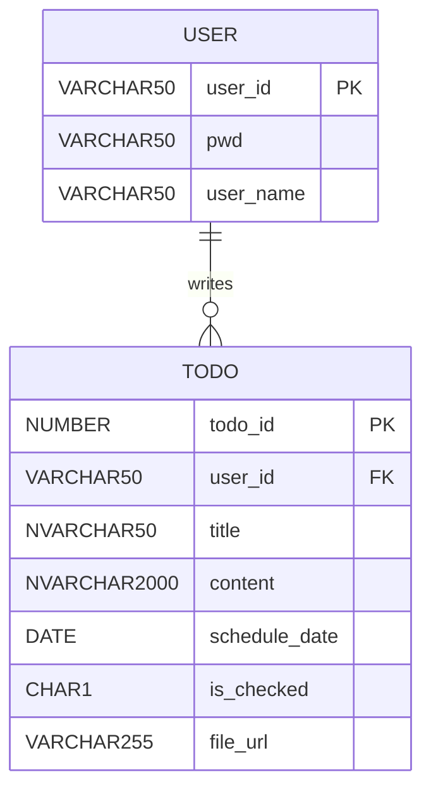

<!-- 문서 작성일: 2026-09-15 -->
# todoProject 전체 구조

이 문서는 `C:\workspace-sts-5.3.0\todoProject`를 공부하기 위한 프로젝트 구조 설명서다. 현재 프로젝트는 로그인 기능이 완성되기 전 단계의 일정 관리 웹 애플리케이션이며, 사용자의 일정(`todo`)을 등록, 조회, 수정, 삭제할 수 있다.

## 1. 한눈에 보는 프로젝트

### 기술 스택

- Java 11
- Spring Boot 2.7.3
- Spring MVC
- Thymeleaf
- MyBatis 2.3.0
- Oracle Database / Oracle JDBC Driver
- Lombok
- Bootstrap 5.3.3, jQuery 3.7.1
- Maven

### 핵심 처리 흐름

```text
브라우저
  -> TodoController
  -> TodoService / TodoServiceImpl
  -> TodoMapper 인터페이스
  -> TodoMapper.xml
  -> Oracle DB
  -> Todo 도메인 객체
  -> TodoResponseDto
  -> Thymeleaf HTML 화면
```

Controller는 HTTP 요청과 화면 이동을 담당하고, Service는 업무 규칙을 처리하며, Mapper는 SQL 실행을 담당한다. DB에서 조회한 `Todo` 도메인 객체는 Service에서 화면 전달용 `TodoResponseDto`로 변환된다.

## 2. 디렉터리 구조

```text
todoProject/
├─ pom.xml
└─ src/
   ├─ main/
   │  ├─ java/kr/or/oti/project/
   │  │  ├─ TodoProjectApplication.java
   │  │  ├─ controller/
   │  │  │  ├─ TodoController.java
   │  │  │  └─ TestController.java
   │  │  ├─ domain/
   │  │  │  ├─ Todo.java
   │  │  │  └─ User.java
   │  │  ├─ dto/
   │  │  │  ├─ TodoResponseDto.java
   │  │  │  ├─ TodoSaveRequestDto.java
   │  │  │  └─ TodoUpdateRequestDto.java
   │  │  ├─ mapper/
   │  │  │  ├─ TodoMapper.java
   │  │  │  └─ UserMapper.java
   │  │  └─ service/
   │  │     ├─ TodoService.java
   │  │     └─ impl/TodoServiceImpl.java
   │  └─ resources/
   │     ├─ application.properties
   │     ├─ mapper/
   │     │  ├─ TodoMapper.xml
   │     │  └─ UserMapper.xml
   │     └─ templates/todo/
   │        ├─ list.html
   │        ├─ read.html
   │        ├─ register.html
   │        └─ modify.html
   └─ test/
      ├─ java/
      └─ resources/
```

`target/`는 Maven 빌드 결과물이다. 직접 수정하는 소스가 아니라 컴파일된 클래스와 복사된 리소스가 저장되는 폴더이므로 학습할 때는 `src/`를 기준으로 보면 된다.

## 3. 애플리케이션 시작점

### `TodoProjectApplication.java`

`@SpringBootApplication`이 붙은 클래스다. `main()`에서 `SpringApplication.run()`을 호출하면 다음 작업이 시작된다.

- Spring 애플리케이션 컨텍스트 생성
- `@Controller`, `@Service`, `@Mapper` 등의 컴포넌트 스캔
- `application.properties`를 이용한 서버와 DB 설정 적용
- 내장 웹 서버 실행

기본 실행 포트는 `8282`다.

## 4. 계층별 역할

### 4.1 Controller 계층

파일: `src/main/java/kr/or/oti/project/controller/TodoController.java`

`@Controller`와 `@RequestMapping("/todo")`를 사용한다. 브라우저 요청을 받아 Service를 호출하고, Thymeleaf 뷰 이름을 반환한다.

| HTTP 메서드 | URL | 역할 | 반환 화면 또는 이동 |
|---|---|---|---|
| GET | `/todo/list` | 현재 사용자의 일정 목록 조회 | `todo/list` |
| GET | `/todo/register` | 일정 등록 화면 표시 | `todo/register` |
| POST | `/todo/save` | 일정 등록 | `/todo/list`로 redirect |
| GET | `/todo/{todo_id}` | 일정 상세 조회 | `todo/read` |
| GET | `/todo/modify/{todo_id}` | 수정 화면 표시 | `todo/modify` |
| POST | `/todo/update` | 일정 수정 | `/todo/list`로 redirect |
| POST | `/todo/delete/{todo_id}` | 일정 삭제 | `/todo/list`로 redirect |

현재 로그인 기능이 연결되지 않았기 때문에 `/todo/list`에서 세션에 `user_id`가 없으면 임시로 `test01`을 넣는다. 실제 로그인 기능을 연결할 때는 이 부분을 인증 결과와 연결해야 한다.

### 4.2 Service 계층

파일:

- `service/TodoService.java`
- `service/impl/TodoServiceImpl.java`

`TodoService`는 일정 업무의 인터페이스다. 구현체인 `TodoServiceImpl`은 `@Service`로 등록되어 Controller가 주입받을 수 있다.

주요 업무는 다음과 같다.

- 등록: 요청 DTO를 `Todo` 객체로 만들고 사용자 ID와 기본 완료 상태를 설정
- 목록: 사용자 ID로 조회한 도메인 목록을 응답 DTO 목록으로 변환
- 상세: 일정 ID로 한 건을 조회하고 응답 DTO로 변환
- 수정: 수정 DTO를 `Todo` 객체로 바꾸어 Mapper 호출
- 삭제: 일정 ID로 삭제

새 일정은 항상 `is_checked = "N"`으로 시작한다. 화면에 전달하는 응답 DTO 변환은 `toResponseDto()`에서 한 곳으로 관리한다.

### 4.3 Domain 계층

파일:

- `domain/Todo.java`
- `domain/User.java`

Domain 객체는 DB 데이터와 가까운 형태의 객체다. Lombok의 `@Getter`, `@Setter`로 접근자 메서드를 자동 생성한다.

`Todo`의 필드는 다음 DB 컬럼과 대응한다.

| Java 필드 | DB 컬럼 | 의미 |
|---|---|---|
| `todo_id` | `todo_id` | 일정 식별자 |
| `user_id` | `user_id` | 작성자 식별자 |
| `title` | `title` | 일정 제목 |
| `content` | `content` | 일정 내용 |
| `schedule_date` | `schedule_date` | 일정 날짜 |
| `is_checked` | `is_checked` | 완료 여부, `Y` 또는 `N` |
| `file_url` | `file_url` | 첨부파일 URL |

Oracle `DATE`는 현재 코드에서 `java.sql.Date`, `NUMBER` 식별자는 `Long`으로 받는다.

### 4.4 DTO 계층

DTO는 요청과 응답의 목적에 맞게 필요한 필드만 전달하는 객체다.

- `TodoSaveRequestDto`: 등록 폼에서 `title`, `content`, `schedule_date`를 받는다. `user_id`는 화면에서 받지 않고 세션에서 가져온다.
- `TodoUpdateRequestDto`: 수정할 `todo_id`, 제목, 내용, 날짜, 완료 여부를 받는다.
- `TodoResponseDto`: 목록과 상세 화면에 전달할 응답 객체다. `Todo`에서 필요한 필드만 골라 Builder로 생성한다.

현재 `TodoResponseDto.from()` 메서드도 있지만 실제 Service 구현은 자체 `toResponseDto()`를 사용한다. 변환 방식을 하나로 통일하면 코드 학습과 유지보수가 더 쉬워진다.

### 4.5 Mapper 계층

파일:

- `mapper/TodoMapper.java`
- `mapper/UserMapper.java`
- `resources/mapper/TodoMapper.xml`
- `resources/mapper/UserMapper.xml`

Java Mapper 인터페이스의 메서드명과 XML의 `namespace`, `id`가 연결된다. `@Mapper` 덕분에 MyBatis가 구현체를 자동으로 만들어 Spring Bean으로 등록한다.

`TodoMapper`의 SQL 기능:

- `insertTodo`: 일정 등록
- `selectTodoListByUser`: 사용자별 목록 조회
- `selectTodoById`: 일정 하나 조회
- `updateTodo`: 제목, 내용, 날짜, 완료 여부 수정
- `deleteTodo`: 일정 삭제
- `searchTodoByTitle`: 제목 검색 SQL. 현재 Controller와 Service에서 호출하지 않는 준비된 기능이다.

등록 SQL은 `<selectKey order="BEFORE">`로 `todo_seq.NEXTVAL`을 먼저 조회해 `todo_id`를 만든다. 따라서 Oracle에 `todo_seq` 시퀀스가 있어야 한다.

## 5. DB 구조

첨부된 ERD 기준으로 사용자와 일정은 1:N 관계다.



### 관계 해석

- `USER.user_id`가 사용자 테이블의 기본 키다.
- `TODO.user_id`가 작성자를 가리키는 외래 키다.
- 한 명의 사용자는 여러 일정을 가질 수 있다.
- 목록 SQL은 `WHERE user_id = #{user_id}`로 사용자별 데이터를 분리한다.
- 현재 코드에는 DB 테이블 생성 DDL이나 외래 키 설정 SQL이 포함되어 있지 않으므로 DB에 별도로 준비되어 있어야 한다.

주의할 점은 Oracle에서 사용자 테이블명이 `user`라서 XML SQL에서 `"user"`처럼 큰따옴표로 감싸져 있다는 점이다. 실제 테이블이 따옴표를 포함한 대소문자 규칙으로 생성되었는지 DB 설정과 함께 확인해야 한다.

## 6. 화면 구조와 Thymeleaf

모든 화면은 `src/main/resources/templates/todo/`에 있다.

### `list.html`

- `todoList` 모델을 `th:each`로 반복
- 일정 날짜를 `yyyy-MM-dd`로 출력
- `is_checked`가 `Y`면 완료 아이콘, 그 외에는 미완료 아이콘 출력
- 일정 항목을 클릭하면 `/todo/{todo_id}`로 이동
- 목록이 비어 있으면 안내 문구 출력

### `register.html`

- `/todo/save`로 POST 전송
- 날짜, 제목, 내용을 입력
- 제목이 비어 있으면 jQuery로 제출을 막음
- 사용자 ID와 완료 여부는 입력받지 않음. 서버가 세션과 기본값으로 처리함

### `read.html`

- 일정 제목, 상태, 날짜, 내용을 표시
- 수정 링크와 삭제 POST 폼 제공
- 삭제 전 JavaScript `confirm()`으로 확인

### `modify.html`

- 기존 일정 데이터를 `th:value`, `th:text`로 입력 폼에 채움
- hidden input으로 `todo_id`를 전송
- 완료 여부를 `Y` 또는 `N`으로 선택
- `/todo/update`로 POST 전송

Thymeleaf의 `th:href`, `th:action`, `th:text`, `th:if`, `th:unless`, `th:each`가 서버에서 HTML을 생성하는 핵심 문법이다.

## 7. 요청별 실행 흐름

### 일정 목록

```text
GET /todo/list
  -> TodoController.list()
  -> 세션 user_id 확인, 없으면 test01 설정
  -> todoService.getTodoList(user_id)
  -> TodoMapper.selectTodoListByUser(user_id)
  -> TodoMapper.xml의 SELECT 실행
  -> Todo 목록을 TodoResponseDto 목록으로 변환
  -> Model에 todoList 저장
  -> todo/list.html 렌더링
```

### 일정 등록

```text
register.html 폼 제출
  -> POST /todo/save
  -> TodoSaveRequestDto 바인딩
  -> 세션에서 user_id 추출
  -> TodoServiceImpl.saveTodo()
  -> Todo 생성, is_checked = N 설정
  -> TodoMapper.insertTodo()
  -> todo_seq.NEXTVAL로 ID 생성
  -> INSERT 실행
  -> /todo/list redirect
```

### 일정 수정과 삭제

수정은 먼저 `GET /todo/modify/{todo_id}`로 기존 값을 조회한 다음, `POST /todo/update`에서 변경값을 저장한다. 삭제는 상세 화면의 `POST /todo/delete/{todo_id}`가 Mapper의 `DELETE`를 실행한 뒤 목록으로 돌아간다.

## 8. 설정과 실행

### DB 설정

`src/main/resources/application.properties`에서 다음을 설정한다.

- 서버 포트: `8282`
- Oracle JDBC URL: `jdbc:oracle:thin:@localhost:1521:XE`
- DB 사용자: `SCOTT`
- MyBatis XML 위치: `classpath:mapper/**/*.xml`
- Domain 별칭 패키지: `kr.or.oti.project.domain`
- Mapper 로그 레벨: `trace`

현재 설정 파일에 DB 비밀번호가 평문으로 들어 있으므로 실제 협업 또는 배포에서는 환경 변수나 별도 비밀 설정으로 분리하는 것이 좋다.

### Maven 실행 예시

프로젝트 폴더에서 다음 명령을 사용할 수 있다.

```bash
mvn spring-boot:run
```

또는 패키징 후 실행한다.

```bash
mvn clean package
java -jar target/Project-0.0.1-SNAPSHOT.jar
```

실행 후 예시 주소:

- 일정 목록: `http://localhost:8282/todo/list`
- 등록 화면: `http://localhost:8282/todo/register`
- 기본 연결 확인: `http://localhost:8282/hello`
- DB 연결 확인: `http://localhost:8282/db-test`
- UserMapper 확인: `http://localhost:8282/mapper-test`

`TestController`의 테스트 URL은 개발용 확인 기능이다. 운영 기능으로 사용할 필요가 없으면 나중에 제거하거나 테스트 코드로 옮길 수 있다.

## 9. 현재 상태와 학습할 때 확인할 부분

현재 구현은 기본 CRUD 학습에 적합하지만 다음 항목은 아직 확장 또는 보완 대상이다.

1. **로그인 미연결**: `test01`을 세션에 임시 저장한다. 실제 인증과 권한 검사가 필요하다.
2. **사용자 기능 미연결**: `UserMapper`에는 등록과 조회 메서드가 있지만 Controller와 Service가 없다.
3. **검색 미사용**: `searchTodoByTitle` XML과 Mapper 메서드는 있으나 Service 메서드는 주석 처리되어 있고 화면 입력도 없다.
4. **첨부파일 미처리**: DB의 `file_url`과 Domain에는 필드가 있지만 등록 DTO, 수정 DTO, 응답 DTO, SQL INSERT/UPDATE에는 실제 처리가 없다.
5. **소유권 검증 부족**: 상세, 수정, 삭제가 `todo_id`만으로 동작한다. 현재 사용자가 해당 일정의 소유자인지 확인하는 로직이 필요하다.
6. **입력 검증 부족**: 화면의 `required`와 jQuery 검증만으로는 충분하지 않다. 서버 DTO에 Bean Validation을 추가해야 한다.
7. **예외 처리 부족**: 존재하지 않는 `todo_id`나 DB 오류가 발생했을 때의 공통 처리와 사용자 화면이 없다.
8. **테스트 부재**: `src/test/java`와 `src/test/resources`에 현재 테스트 파일이 없다. Service 단위 테스트와 Controller/Mapper 통합 테스트를 추가하면 좋다.
9. **DTO 변환 중복**: `TodoResponseDto.from()`과 `TodoServiceImpl.toResponseDto()`가 함께 존재한다. 하나로 정리할 수 있다.
10. **Mapper 파라미터 명시성**: 검색 메서드처럼 여러 파라미터를 XML에서 사용할 때는 `@Param("user_id")`, `@Param("keyword")`를 붙이는 방식이 안전하다.

## 10. 추천 학습 순서

1. `TodoProjectApplication.java`에서 Spring Boot 시작 구조 확인
2. `TodoController.java`에서 URL과 화면 이동 확인
3. `TodoService.java`와 `TodoServiceImpl.java`에서 업무 흐름 확인
4. `Todo.java`, DTO 클래스에서 데이터 이동 형태 확인
5. `TodoMapper.java`와 `TodoMapper.xml`을 비교하며 Java 메서드와 SQL 연결 확인
6. `list.html`부터 `register.html`, `read.html`, `modify.html` 순서로 Thymeleaf 바인딩 확인
7. Oracle의 `USER`, `TODO`, `todo_seq`를 준비하고 CRUD 실행
8. 로그인, 검색, 파일, 검증, 테스트를 차례로 확장

이 프로젝트의 핵심은 한 기능이 여러 계층을 통과한다는 점이다. 예를 들어 등록 기능 하나를 공부할 때 Controller의 DTO 바인딩, Service의 도메인 객체 생성, Mapper의 SQL 파라미터 전달, Oracle INSERT, redirect 후 목록 재조회까지 한 흐름으로 따라가면 Spring MVC와 MyBatis의 역할 분담을 이해하기 쉽다.
