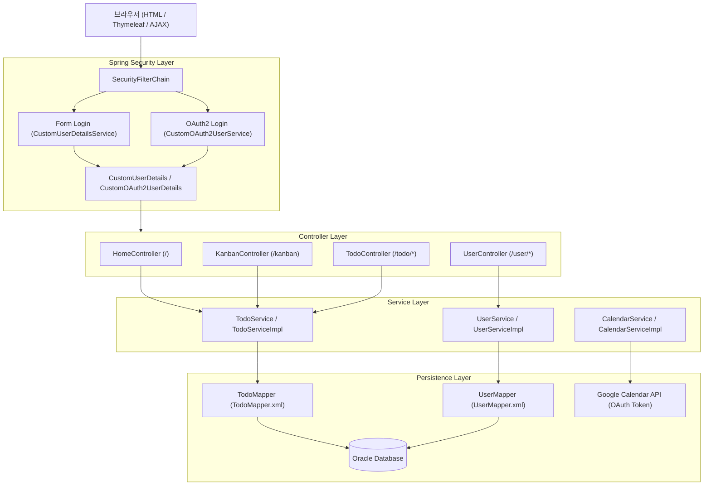

# todoProject 통합 리뷰 및 아키텍처 정리 (structure10)

## 1. 개요

본 문서는 `todoProject`의 고도화 작업 결과를 종합 리뷰하고, 주요 기능의 구현 원리, 아키텍처 설계, 보안 및 트러블슈팅 과정을 정리한 기술 문서다.

이번 고도화에서 중점적으로 다룬 6가지 핵심 영역은 다음과 같다:

1. **레이아웃 통일 (UI/UX 공통화)**: Thymeleaf Fragment와 CSS를 활용한 모듈식 레이아웃 구축
2. **홈 대시보드 신규 구현 (`/`)**: 오늘 일정 및 최근 작업을 집계하는 랜딩 대시보드
3. **칸반 보드 신규 구현 (`/kanban`)**: HTML5 Drag & Drop과 비동기 AJAX를 통한 실시간 상태 전환
4. **URL 이동 규칙 및 통로 일원화 (`prev_url`)**: 다중 진입 경로(홈, 캘린더, 목록, 칸반)와 복귀 흐름 정립
5. **일반 로그인 & 구글 OAuth2 로그인 통합**: `CustomUserDetails` 상속 구조를 통한 다형성 인증 처리
6. **CSRF 보안 재정립 및 트러블슈팅**: Form/AJAX 토큰 주입 및 폼 중첩 버그 디버깅

---

## 2. 레이아웃 통일 (디자인 및 UI 공통화)

### 2.1 기존 문제점
- 각 뷰 템플릿마다 사이드바, 헤더, 내비게이션, 스타일 코드가 중복 작성되어 유지보수가 어렵고 화면별 디자인 통일성이 결여됨.

### 2.2 해결 및 구현 구조
- **템플릿 모듈화 (`templates/fragments/layout.html`)**:
  - `sidebar(activeMenu)`: 사이드바 프래그먼트. 현재 활성화된 메뉴(`home`, `calendar`, `todo/list`, `kanban`, `todo/stats`)에 맞춰 `.active` 스타일 적용.
  - `header(title)`: 각 페이지 상단 제목 출력 및 로그인 사용자 이름 표시, 로그아웃 폼 공통화.
  - `csrfMeta`: AJAX 통신을 위한 CSRF 메타태그 프래그먼트.
- **공통 스타일 시트 (`static/css/common.css`)**:
  - Flex 기반 2단 레이아웃 (`.app-container` -> `.sidebar`(230px 고정) + `.main`(가변)).
  - 일관된 색상 팔레트, 폰트, 카드 UI(`.card`, `.todo-card`, `.kanban-card`), 헤더(`.header`), 콘텐츠 패딩(`.content`) 정의.
- **적용 방식**:
  ```html
  <div class="app-container">
      <div th:replace="~{fragments/layout :: sidebar('home')}"></div>
      <main class="main">
          <div th:replace="~{fragments/layout :: header('홈')}"></div>
          <section class="content">
              <!-- 본문 콘텐츠 -->
          </section>
      </main>
  </div>
  ```

---

## 3. 홈 대시보드 신규 구현 (`/`)

### 3.1 기능 요약
- 로그인 직후 사용자에게 가장 중요한 정보를 요약 제공하는 랜딩 페이지.
- **오늘의 일정**: 당일 날짜와 일치하는 일정 목록.
- **최근 작업**: 최신 등록/수정순 상위 5건의 일정.

### 3.2 핵심 처리 흐름
```
사용자 접속 (GET /)
   ↓
HomeController.home(@AuthenticationPrincipal CustomUserDetails userDetails)
   ↓
todoService.getAllTodoByUser(user_no) (전체 일정 조회)
   ↓
Java 8 Stream API 가공
   ├─ todayTodos  : schedule_date.toLocalDate().equals(LocalDate.now())
   └─ recentTodos : sorted(내림차순).limit(5)
   ↓
home.html (카드 렌더링 & 클릭 시 prev_url=/ 전달)
```

### 3.3 핵심 소스 코드 (`HomeController.java`)
```java
@GetMapping("/")
public String home(@AuthenticationPrincipal CustomUserDetails userDetails, Model model) {
    Long user_no = userDetails.getUser_no();
    List<TodoResponseDto> allTodos = todoService.getAllTodoByUser(user_no);

    // 1. 오늘의 일정 (java.sql.Date -> LocalDate 변환 후 오늘 날짜와 비교)
    List<TodoResponseDto> todayTodos = allTodos.stream()
            .filter(todo -> todo.getSchedule_date().toLocalDate().equals(LocalDate.now()))
            .collect(Collectors.toList());

    // 2. 최근 작업 (최신 날짜순 정렬 후 상위 5개 추출)
    List<TodoResponseDto> recentTodos = allTodos.stream()
            .sorted((a, b) -> b.getSchedule_date().compareTo(a.getSchedule_date()))
            .limit(5)
            .collect(Collectors.toList());

    model.addAttribute("todayTodos", todayTodos);
    model.addAttribute("recentTodos", recentTodos);
    return "home";
}
```

---

## 4. Kanban 보드 신규 구현 (`/kanban`)

### 4.1 기능 요약
- 전체 Todo를 3개의 상태 컬럼(**⬜ 시작 전 TODO**, **🔄 진행 중 DOING**, **✅ 완료 DONE**)으로 시각화.
- 마우스 드래그 앤 드롭으로 카드를 다른 컬럼에 놓으면, 페이지 새로고침 없이 비동기 AJAX로 DB 상태가 즉시 갱신됨.

### 4.2 아키텍처 및 이벤트 흐름
```
[브라우저 Kanban UI] ──── Drag & Drop ────> [drop 이벤트 발생]
        │                                          │
        │ AJAX POST /todo/updateStatus             │
        │ (todo_id, status, CSRF Token Header)     │
        ↓                                          ↓
[TodoController.updateStatus()]                    │
        ↓                                          │
[TodoServiceImpl.updateStatus()]                   │
        ↓                                          │
[TodoMapper.updateStatus (DB 갱신)]                │
        │                                          │
   HTTP 200 OK                                     │
        ↓                                          ↓
[DOM 조작] <────────── targetColumn.append(card) ───┘
```

### 4.3 보안 및 무결성 검증 (IDOR 방어)
- `updateStatus` 쿼리 실행 시 `todo_id`와 함께 반드시 로그인한 사용자의 `user_no`를 조건절에 포함하여 타인의 일정을 임의로 변경하지 못하도록 검증.
- `TodoMapper.xml`:
  ```xml
  <update id="updateStatus">
      UPDATE TODO
      SET status = #{status}
      WHERE todo_id = #{todo_id}
        AND user_no = #{user_no}
  </update>
  ```
- `TodoServiceImpl.java`:
  ```java
  @Override
  public void updateStatus(Long todo_id, String status, Long user_no) {
      int updatedRows = todoMapper.updateStatus(todo_id, status, user_no);
      if (updatedRows == 0) {
          throw new AccessDeniedException("본인 일정만 상태를 변경할 수 있습니다.");
      }
  }
  ```

---

## 5. URL 이동 규칙 및 통로 일원화 (`prev_url`)

### 5.1 도입 배경
- 사용자가 Todo 상세 조회(`read.html`) 및 수정(`modify.html`)으로 접근할 수 있는 진입 경로가 다양화됨:
  - 홈 대시보드 (`/`)
  - 캘린더 화면 (`/calendar`)
  - 일정 목록 (`/todo/list`)
  - 칸반 보드 (`/kanban`)
- 이전에는 무조건 `/todo/list`로만 리다이렉트되어 사용자가 작업하던 원래 화면(예: 칸반 보드나 캘린더)으로 돌아가지 못하는 UX 문제가 발생함.

### 5.2 `prev_url` 전달 메커니즘
1. **진입 시점**: 각 화면에서 상세 페이지 링크를 호출할 때 `prev_url` 파라미터 전달
   - 홈: `/todo/{id}?prev_url=/`
   - 캘린더: `/todo/{id}?prev_url=/calendar`
   - 칸반: `/todo/{id}?prev_url=/kanban`
   - 목록: `/todo/{id}?page=1&keyword=...&prev_url=/todo/list`
2. **상세 조회 (`read.html`)**:
   - `[목록]` 버튼: `<a th:href="${prev_url}">목록</a>`
   - `[수정]` 버튼: `<a th:href="@{/todo/modify/{id}(..., prev_url=${prev_url})}">수정</a>`
3. **수정/삭제 처리 (`modify.html` & `TodoController`)**:
   - 수정 폼에 `<input type="hidden" name="prev_url" th:value="${prev_url}">` 전달.
   - 수정 완료 후: `redirect:{prev_url}`
   - 삭제 완료 후: `redirect:{prev_url}`

---

## 6. 일반 로그인 & 구글 OAuth2 로그인 통합

### 6.1 계층 설계: `CustomUserDetails` 상속 구조
일반 Form 로그인과 구글 OAuth2 로그인의 Principal 객체를 단일 상속 구조로 통합하여, Controller와 Service 계층에서 인증 방식에 구애받지 않고 동일한 코드로 처리할 수 있도록 설계했다.

```
                  UserDetails (Spring Security 인터페이스)
                        ▲
                        │ implements
                CustomUserDetails (일반 폼 로그인)
                  - User user (도메인)
                  - getUser_no()
                  - getUsername()
                        ▲
                        │ extends + implements OAuth2User
              CustomOAuth2UserDetails (구글 소셜 로그인)
                  - Map<String, Object> attributes
```

### 6.2 다형성을 활용한 Controller 단순화
- `CustomOAuth2UserDetails`가 `CustomUserDetails`를 상속하므로, 모든 컨트롤러 메서드에서 아래와 같이 동일하게 주입받을 수 있다:
```java
@GetMapping("/list")
public String list(@AuthenticationPrincipal CustomUserDetails userDetails) {
    Long userNo = userDetails.getUser_no(); // 일반/구글 로그인 모두 정상 동작
    ...
}
```

### 6.3 `CustomOAuth2UserService`의 신규 사용자 자동 가입 처리
```java
@Service
@RequiredArgsConstructor
public class CustomOAuth2UserService extends DefaultOAuth2UserService {

    private final UserMapper userMapper;
    private final PasswordEncoder passwordEncoder;

    @Override
    public OAuth2User loadUser(OAuth2UserRequest userRequest) throws OAuth2AuthenticationException {
        OAuth2User oAuth2User = super.loadUser(userRequest);
        String email = oAuth2User.getAttribute("email");
        String name = oAuth2User.getAttribute("name");

        User loginUser = resolveUser(email, name);
        return new CustomOAuth2UserDetails(loginUser, oAuth2User.getAttributes());
    }

    public User resolveUser(String email, String name) {
        User existingUser = userMapper.selectUserById(email);
        if (existingUser == null) {
            User newUser = new User();
            newUser.setUser_id(email);
            newUser.setPwd(passwordEncoder.encode(UUID.randomUUID().toString()));
            newUser.setUser_name(name);
            newUser.setRole(UserRole.USER);
            userMapper.insertUser(newUser);
            return newUser;
        }
        return existingUser;
    }
}
```

---

## 7. CSRF 재정립 및 트러블슈팅

### 7.1 CSRF 처리 전략

| 구분 | 적용 방식 | 세부 내용 |
| :--- | :--- | :--- |
| **일반 Form 전송 (POST)** | Hidden Input 필드 | `<input type="hidden" th:name="${_csrf.parameterName}" th:value="${_csrf.token}">` |
| **비동기 AJAX 요청** | Meta 태그 + Header 설정 | `layout.html`의 `<meta name="_csrf">`를 읽어 `$.ajaxSetup()`에서 `X-CSRF-TOKEN` 헤더에 자동 주입 |
| **로그아웃 요청** | Form POST 전송 | Spring Security 4/5 권장사항에 맞춰 `/user/logout`을 POST 방식으로 전송 |

### 7.2 주요 트러블슈팅 정리

| 문제 현상 | 원인 | 해결 방법 |
| :--- | :--- | :--- |
| **수정 화면 첨부파일 삭제 오류** | 파일 삭제 버튼과 폼이 중첩 `<form>` 구조로 작성됨 | 삭제 전용 hidden form 분리 및 JS submit 처리 |
| **상세/수정 후 이전 화면 복귀 불가** | 진입 경로 정보가 소실됨 | `prev_url` 파라미터 전달 체계 구축 |
| **Google 로그인 후 일정 등록 시 강제 로그아웃** | `layout.html`의 로그아웃 `<form>` 닫는 태그(`</form>`) 누락 | HTML 구조 수정 및 폼 분리 |
| **FullCalendar `todo is not defined`** | JS 변수 스코프 충돌 | `todoEvents`와 `googleCalendarEvents` 명확히 분리 |
| **POST/AJAX 요청 시 403 Forbidden** | CSRF 토큰 누락 | `layout.html`에 CSRF Meta 태그 삽입 및 `$.ajaxSetup` 헤더 자동 첨부 |
| **로그아웃 동작 오류** | GET 요청으로 로그아웃 시도 시 Security와 불일치 | `/user/logout` POST 전송 및 CSRF 토큰 포함 |

---

### 7.3 발표 및 면접 핵심 트러블슈팅 사례

#### 💡 사례: "Google 로그인 후 일정 등록 시 로그아웃되는 기현상"

1. **현상**:
   - Google OAuth2 로그인 후 새 일정을 작성하고 [등록] 버튼을 누르면 저장이 되지 않고 즉시 로그인 페이지로 튕김.

2. **디버깅 과정**:
   ```
   [1] Controller 확인 : TodoController.save() 메서드에 로그가 전혀 찍히지 않음
            ↓
   [2] Spring Security 디버그 로그 확인 : POST /todo/save 요청이 들어오지 않고 POST /user/logout이 발생함
            ↓
   [3] 브라우저 개발자 도구 DOM 확인 : layout.html의 상단 헤더에 위치한 로그아웃 <form>의 닫는 태그(</form>)가 누락됨
            ↓
   [4] 원인 분석 : 브라우저가 본문의 일정 등록 <form th:action="@{/todo/save}">을 상위 로그아웃 <form th:action="@{/user/logout}">의 내부 요소로 잘못 파싱함
            ↓
   [5] 결과 : [등록] submit 버튼 클릭 시 상위의 /user/logout 액션이 실행되어 즉시 세션이 만료되고 로그아웃됨
            ↓
   [6] 조치 : layout.html의 폼 닫는 태그를 정상화하고 독립된 Form 구조로 수정하여 해결
   ```

3. **시사점**:
   - 복잡한 보안 필터 문제처럼 보였으나, 서버 사이드 렌더링(SSR) 환경에서 템플릿 프래그먼트의 HTML 태그 누락이 전체 애플리케이션의 폼 동작과 보안 흐름에 치명적인 영향을 줄 수 있음을 확인.
   - 로그 추적(Controller 로그 -> Security Filter 로그 -> DOM 분석)을 체계적으로 진행하여 원인을 신속히 격리함.

---

## 8. 전체 아키텍처 요약 다이어그램

