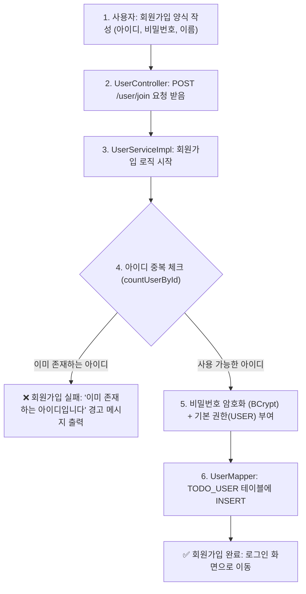
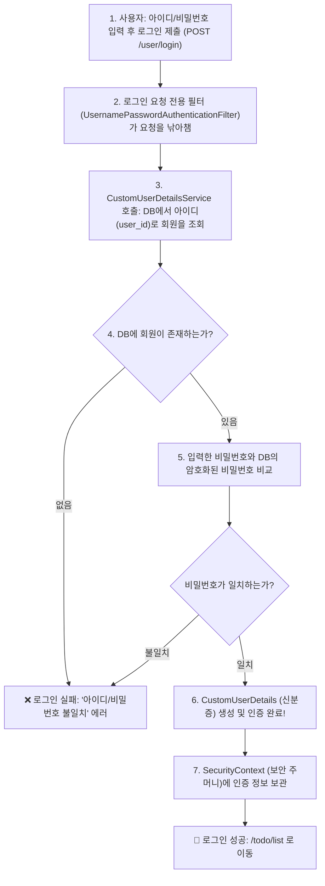
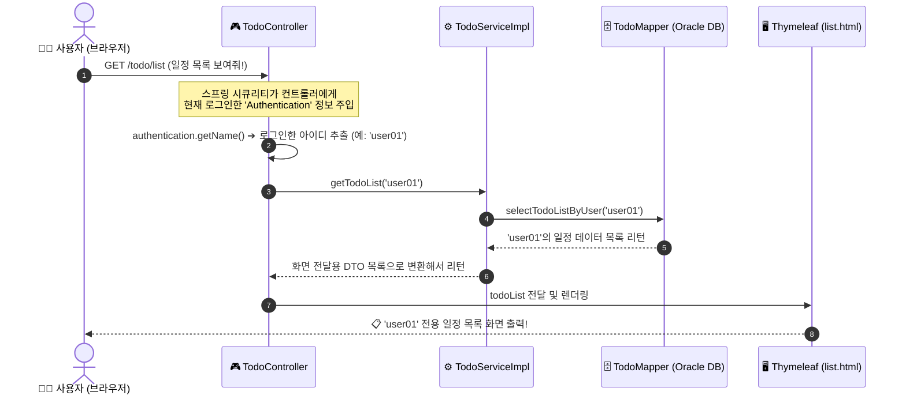
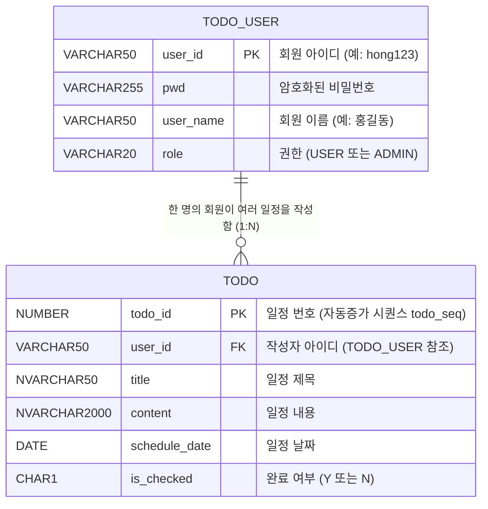

<!-- 문서 작성일: 2026-09-16 (초보자 맞춤형 해설판) -->
# 🔰 todoProject 초보 개발자를 위한 프로젝트 & Spring Security 안내서

> 💡 **이 문서는 이제 막 개발을 시작한 1달 차 개발자의 눈높이에 맞춰 작성되었습니다!**
> VSCode에서 Markdown Preview (`Ctrl + K` ➔ `V`)를 켜고 읽으시면 다이어그램과 코드가 한눈에 쏙 들어옵니다.

---

## 1. 이 프로젝트는 어떤 프로젝트인가요?

이 프로젝트(`todoProject`)는 **"사용자별로 나의 할 일을 등록하고 관리하는 일정 관리 웹 서비스"**입니다.

### 🐣 1단계 vs 2단계 (무엇이 달라졌나요?)

* **1단계 (이전)**: 로그인 기능이 없어서, 누구든 접속하면 임시로 `test01`이라는 가짜 아이디로 접속한 것처럼 구동되었습니다.
* **2단계 (현재)**: **스프링 시큐리티(Spring Security)**라는 보안 도구가 도입되어, 진짜 회원가입을 하고 로그인한 사람만 자기 일정을 볼 수 있게 되었습니다!

---

## 2. 쉬운 비유로 이해하는 핵심 개념 💡

스프링 시큐리티와 웹 개발 용어가 어렵다면 아래 비유를 생각해보세요!

| 전문 용어 | 쉬운 비유 | 역할과 설명 |
|---|---|---|
| **Spring Security (스프링 시큐리티)** | **아파트 경비실 & 보안 시스템** | 허락되지 않은 사람이 주민 전용 공간(일정 목록 등)에 들어오지 못하게 막아줍니다. |
| **BCryptPasswordEncoder** | **비밀번호 암호화 기계** | 사용자가 입력한 비밀번호(`1234`)를 아무도 알아보지 못하게 난해한 문자열(`$2a$10...`)로 찌그러뜨려 저장합니다. |
| **SecurityFilterChain (보안 필터 체인)** | **아파트 출입문 문지기 규칙** | "회원가입/로그인 페이지는 누구나 통과, 일정 관리 페이지는 로그인한 주민만 통과!" 같은 규칙을 관리합니다. |
| **UsernamePasswordAuthenticationFilter** | **로그인 전용 검문소** | 사용자가 아이디/비밀번호를 적어서 제출했을 때 그걸 중간에서 낚아채서 검사하는 문지기입니다. |
| **UserDetails (CustomUserDetails)** | **스프링이 인식하는 회원 신분증** | DB에서 가져온 회원 정보를 스프링 시큐리티가 이해할 수 있는 표준 신분증 양식으로 감싼 것입니다. |
| **UserDetailsService (CustomUserDetailsService)** | **신분증 발급 창구 (DB 조회원)** | 로그인할 때 입력한 아이디로 DB를 뒤져서 진짜 회원이 맞는지 확인하고 신분증을 발급해 줍니다. |
| **SecurityContext (보안 컨텍스트)** | **주머니 속 출입증 주머니** | 로그인이 성공하면 "이 사람 인증됨!" 증명서를 주머니에 넣어두고, 페이지를 이동할 때마다 꺼내서 확인합니다. |

---

## 3. 한눈에 보는 폴더 및 파일 구조

주요 파일들을 클릭하면 VSCode에서 바로 해당 코드로 이동할 수 있습니다.

```text
todoProject/
├─ pom.xml                                           # 프로젝트 도구 및 라이브러리 목록 (스프링 시큐리티 추가됨)
└─ src/main/java/kr/or/oti/project/
   ├─ config/
   │  └─ CustomSecurityConfig.java                  # 🛡️ [보안 설정] 어떤 URL을 막고 열어줄지 정하는 곳
   ├─ controller/
   │  ├─ UserController.java                        # 👤 [회원 컨트롤러] 회원가입/로그인 화면으로 보내주는 곳
   │  └─ TodoController.java                        # 📋 [일정 컨트롤러] 일정 조회/등록/수정/삭제를 처리하는 곳
   ├─ domain/
   │  ├─ User.java                                  # 👤 [회원 정보] DB의 회원 테이블과 1:1 대응되는 자바 객체
   │  ├─ Todo.java                                  # 📋 [일정 정보] DB의 일정 테이블과 1:1 대응되는 자바 객체
   │  └─ UserRole.java                              # 🔑 [권한 종류] USER(일반회원), ADMIN(관리자)
   ├─ dto/
   │  ├─ TodoSaveRequestDto.java                    # 📥 일정 등록할 때 화면에서 받아오는 데이터 묶음
   │  ├─ TodoUpdateRequestDto.java                  # 📥 일정 수정할 때 화면에서 받아오는 데이터 묶음
   │  └─ TodoResponseDto.java                      # 📤 화면으로 일정을 보낼 때 예쁘게 포장하는 데이터 묶음
   ├─ security/
   │  ├─ CustomUserDetails.java                     # 🆔 [신분증] DB 회원 정보를 시큐리티용 신분증으로 변환
   │  └─ CustomUserDetailsService.java               # 🔍 [신분증 조회] DB에서 아이디로 회원을 찾는 클래스
   ├─ service/
   │  ├─ UserServiceImpl.java                       # ⚙️ [회원 기능 실행] 회원가입(아이디 중복체크 + 암호화) 처리
   │  └─ TodoServiceImpl.java                       # ⚙️ [일정 기능 실행] 실제 일정 저장, 조회 비즈니스 로직
   └─ mapper/
      ├─ UserMapper.java & UserMapper.xml            # 🗄️ [회원 DB 쿼리] 회원 관련 SQL 문장 (TODO_USER 테이블)
      └─ TodoMapper.java & TodoMapper.xml            # 🗄️ [일정 DB 쿼리] 일정 관련 SQL 문장 (todo 테이블)
```

* 📄 [보안 설정 파일 열기](file:///c:/workspace-sts-5.3.0/todoProject/src/main/java/kr/or/oti/project/config/CustomSecurityConfig.java)
* 📄 [회원가입 컨트롤러 열기](file:///c:/workspace-sts-5.3.0/todoProject/src/main/java/kr/or/oti/project/controller/UserController.java)
* 📄 [일정 관리 컨트롤러 열기](file:///c:/workspace-sts-5.3.0/todoProject/src/main/java/kr/or/oti/project/controller/TodoController.java)

---

## 4. 회원가입과 로그인 흐름 한눈에 보기

### 4.1 회원가입은 어떻게 진행되나요?

사용자가 회원가입 버튼을 누르고 정보가 저장되기까지의 과정입니다.



#### 코드로 보는 핵심 포인트 (UserServiceImpl.java)
```java
// 비밀번호를 암호화하고 회원을 저장하는 핵심 부분
String encodedPwd = passwordEncoder.encode(user.getPwd()); // 1234 -> $2a$10$e8... (암호화)
user.setPwd(encodedPwd);
user.setRole(UserRole.USER); // 기본 권한 부여
userMapper.insertUser(user); // DB에 저장
```

---

### 4.2 로그인은 어떻게 진행되나요?

로그인은 컨트롤러가 직접 받지 않고, **스프링 시큐리티 문지기(필터)**가 자동으로 처리합니다.



---

## 5. 로그인 성공 후 일정 관리(Todo) 흐름

로그인이 성공하면 스프링 시큐리티는 인증된 사용자 정보를 계속 기억해 둡니다.



---

## 6. DB(데이터베이스)는 어떻게 생겼나요?

Oracle DB에 들어있는 테이블 구조입니다.



---

## 7. 1달 차 개발자를 위한 다음 공부 & 보완 과제 🎯

현재 프로젝트는 잘 작동하지만, 개발자로서 발전시키면 좋은 **개선 포인트**들입니다!

### 1️⃣ [보안] 내 일정이 아닌 남의 일정을 지울 수 있는 위험 막기!
* **현재 상태**: 상세 보기(`/todo/1`), 수정, 삭제할 때 `todo_id` 번호만으로 처리하고 있습니다.
* **위험성**: 내가 `user01`로 로그인했더라도 주소창에 `/todo/delete/5` (다른 사람 `user02`의 일정 번호)를 직접 타이핑하면 남의 일정이 지워질 수 있습니다!
* **개선 방법**: 삭제나 수정 시에도 "이 일자의 주인(`user_id`)이 현재 로그인한 사용자와 같은지" 확인하는 로직을 추가해야 합니다.

### 2️⃣ [안정성] 화면 입력값 검증 (Bean Validation)
* **현재 상태**: HTML에서 `required` 속성으로만 빈 값을 막고 있습니다.
* **개선 방법**: 사용자가 제목을 10,000자 이상 아주 길게 넣거나 악의적으로 빈 값을 보냈을 때 자바 코드 수준(`@NotBlank`, `@Size`)에서 한 번 더 꼼꼼하게 검사해 주는 것이 좋습니다.

### 3️⃣ [에러 처리] 친절한 에러 페이지 만들기
* **현재 상태**: 오류가 발생하면 흰색 바탕에 영어가 가득한 스프링 기본 에러 화면(Whitelabel Error Page)이 나옵니다.
* **개선 방법**: `@ControllerAdvice`라는 기능을 이용해 "찾으시는 일정이 없습니다" 또는 "접근 권한이 없습니다"라는 예쁜 에러 안내 화면을 보여주도록 발전시킬 수 있습니다.

---

## 8. 한 줄 요약 📝

1. **스프링 시큐리티**가 로그인 검문소 역할을 해줍니다.
2. 비밀번호는 **BCrypt 암호기**로 안전하게 암호화되어 DB에 저장됩니다.
3. 로그인에 성공하면 컨트롤러에서 `authentication.getName()`으로 **내 아이디를 안전하게 꺼내어** 내 일정만 조회/등록합니다!


## 9. 추가 점검
1. 📄 페이징 (Pagination) ➔ [ 아직 안 만들어짐 ]
현재 상태: 현재 코드는 사용자가 등록한 일정이 10개든 1,000개든 한 번에 전부 다 가져와서 한 화면에 다 보여주는 방식입니다.
무슨 의미인가요?:
우리가 게시판을 볼 때 아래에 [1] [2] [3] [다음] 처럼 페이지를 나눠서 10개씩 끊어 보는 것을 '페이징'이라고 합니다.
현재 우리 프로젝트에는 이 '10개씩 끊어서 가져오는 기능'이 없어서, 나중에 일정이 1만 개가 쌓이면 화면이 엄청 늦게 뜨거나 다운될 수 있습니다.
2. 🚨 예외 처리 (Exception Handling) ➔ [ 아직 안 만들어짐 ]
현재 상태: 지금은 에러(DB 연결 끊김, 없는 일정 번호 요청 등)가 발생하면, 스프링이 기본으로 보여주는 **영어가 가득한 하얀색 에러 화면(Whitelabel Error Page)**이 그대로 뜹니다.
무슨 의미인가요?:
에러가 났을 때 "요청하신 일정을 찾을 수 없습니다" 같은 친절한 안내 화면을 보여주는 공통 예외 처리기(@ControllerAdvice) 코드가 아직 작성되어 있지 않은 상태입니다.
3. 🛡️ SQL 인젝션 (SQL Injection) 방어 ➔ [ 이미 잘 적용되어 있음! ]
현재 상태: 따로 추가할 필요 없이 이미 안전하게 방어되어 있습니다.
무슨 의미인가요?:
'SQL 인젝션'은 해커가 로그인 입력창에 아이디 대신 admin' -- 같은 이상한 DB 명령어를 넣어서 남의 계정으로 몰래 로그인하거나 DB를 삭제하는 대표적인 해킹 기법입니다.
우리 프로젝트의 XML 파일들을 보면 SQL을 쓸 때 #{user_id}, #{title}처럼 #{ } 문법을 사용했습니다.
MyBatis에서 #{ }를 쓰면 스프링과 DB가 알아서 사용자가 입력한 값을 물리적인 텍스트 글자로만 인식하게 만들어서 해킹 명령어가 실행되지 않도록 자동으로 싹 막아줍니다!
💡 요약하자면!

"해킹 방어(SQL 인젝션)는 이미 #{ } 문법 덕분에 자동으로 잘 되고 있고, **페이징(10개씩 끊어보기)**과 **예외 처리(친절한 에러 화면)**는 나중에 필요할 때 추가로 코드를 짜서 만드시면 됩니다!"
