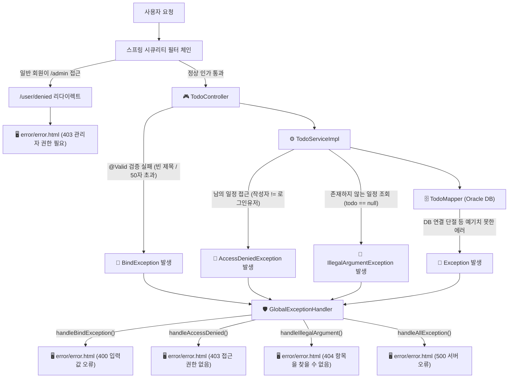

<!-- 문서 작성일: 2026-09-16 (예외 처리 및 보안 고도화 반영) -->
# 📋 todoProject 3차 개선: 검색 기능 + 예외 처리 및 보안 고도화

> 이 문서는 이번에 수정한 파일들이 **기존에 어떤 문제가 있었는지**, **어떻게 바뀌었는지**, **왜 그렇게 바꿨는지**를 초보 개발자의 눈높이에서 알기 쉽게 설명합니다.

---

## 📌 수정된 전체 파일 목록

| 파일 | 변경 내용 요약 |
|---|---|
| `pom.xml` | `spring-boot-starter-validation` 의존성 추가 |
| `TodoSaveRequestDto.java` | 빈 제목, 날짜 누락, 글자 수 초과 방지 검증 어노테이션(`@NotBlank`, `@Size` 등) 추가 |
| `TodoUpdateRequestDto.java` | 수정 요청 시 필수값 및 글자 수 검증 어노테이션 추가 |
| `TodoMapper.java` | `@Param` 명시적으로 추가 |
| `TodoMapper.xml` | 설명 주석 보강 |
| `TodoService.java` | 소유권 검증을 위한 `user_id` 파라미터 추가 & `searchTodoByTitle` 선언 |
| `TodoServiceImpl.java` | **남의 일정 접근 차단(소유권 검증)**, null 처리, 0건 처리, 검색 기능 구현 |
| `TodoController.java` | 검색 파라미터 연결, **`@Valid` 유효성 검사 적용**, **소유권 검증용 `user_id` 전달** |
| `CustomSecurityConfig.java` | 관리자 페이지 무단 접근 시 403 에러 안내 페이지 연결 (`/user/denied`) |
| `UserController.java` | 403 접근 권한 없음 안내 화면 매핑 (`/user/denied`) |
| `GlobalExceptionHandler.java` | **입력값 검증 실패(400)**, **소유권/접근 권한 없음(403)**, **존재하지 않음(404)**, **서버 오류(500)** 전담 처리 |
| `list.html` | 검색 폼 UI 및 전체보기 버튼 추가 |

---

## 변경 1. `TodoMapper.java` — `@Param` 명시

### 🔴 기존 코드
```java
// 파라미터가 2개인데 이름을 알려주지 않아 MyBatis가 혼동할 수 있음
List<Todo> searchTodoByTitle(String user_id, String keyword);
```

### 🟢 수정 코드
```java
// @Param 으로 이름을 고정 → XML 의 #{user_id}, #{keyword} 와 정확히 매핑됨
List<Todo> searchTodoByTitle(@Param("user_id") String user_id,
                              @Param("keyword") String keyword);
```

### 💡 왜 수정했나요?
MyBatis는 파라미터가 1개일 때는 이름이 없어도 알아서 처리하지만, 2개 이상일 때는 XML에서 `#{user_id}`가 어느 파라미터인지 헷갈릴 수 있습니다.  
`@Param("이름")`을 붙여주면 **"이 파라미터의 이름은 user_id야!"** 라고 MyBatis에게 명확하게 알려줄 수 있습니다.

---

## 변경 2. `TodoService.java` & `TodoServiceImpl.java` — 남의 일정 조회/수정/삭제 방지 (소유권 검증)

### 🔴 기존 코드
```java
// TodoServiceImpl.java
// 번호(todo_id)만 일치하면 남의 일정도 그대로 조회/수정/삭제됨 (위험!)
public TodoResponseDto getTodo(Long todo_id) {
    Todo todo = todoMapper.selectTodoById(todo_id);
    if (todo == null) {
        throw new IllegalArgumentException("존재하지 않는 일정입니다.");
    }
    return TodoResponseDto.from(todo);
}

public void deleteTodo(Long todo_id) {
    int deletedRows = todoMapper.deleteTodo(todo_id);
    if (deletedRows == 0) {
        throw new IllegalArgumentException("삭제할 일정을 찾을 수 없습니다.");
    }
}
```

### 🟢 수정 코드
```java
// TodoServiceImpl.java
// 1. 상세 조회: 내 일정이 아니면 403 접근 거부 예외 발생!
@Override
public TodoResponseDto getTodo(Long todo_id, String user_id) {
    Todo todo = todoMapper.selectTodoById(todo_id);

    if (todo == null) {
        throw new IllegalArgumentException("존재하지 않는 일정입니다. (id: " + todo_id + ")");
    }

    // 🚨 작성자와 현재 로그인한 사용자가 다르면 차단!
    if (!todo.getUser_id().equals(user_id)) {
        throw new AccessDeniedException("해당 일정을 조회할 권한이 없습니다.");
    }

    return TodoResponseDto.from(todo);
}

// 2. 삭제: 내 일정이 맞는지 먼저 확인하고 삭제!
@Override
public void deleteTodo(Long todo_id, String user_id) {
    Todo existing = todoMapper.selectTodoById(todo_id);

    if (existing == null) {
        throw new IllegalArgumentException("삭제할 일정을 찾을 수 없습니다. (id: " + todo_id + ")");
    }

    // 🚨 작성자와 현재 로그인한 사용자가 다르면 차단!
    if (!existing.getUser_id().equals(user_id)) {
        throw new AccessDeniedException("해당 일정을 삭제할 권한이 없습니다.");
    }

    int deletedRows = todoMapper.deleteTodo(todo_id);
    if (deletedRows == 0) {
        throw new IllegalArgumentException("삭제할 일정을 찾을 수 없습니다. (id: " + todo_id + ")");
    }
}
```

### 💡 왜 수정했나요?
기존에는 URL에 `todo_id` 번호만 알면 악의적인 사용자가 다른 사람의 일정을 조회하거나 몰래 삭제할 수 있었습니다(이를 보안 용어로 **IDOR / BOLA 취약점**이라고 부릅니다).  
이제는 Service에서 **"이 일정의 주인(`existing.getUser_id()`)이 현재 로그인한 사람(`user_id`)과 같은지"** 철저하게 확인하여, 다를 경우 스프링 시큐리티의 `AccessDeniedException(접근 권한 없음)`을 던져 안전하게 방어합니다.

---

## 변경 3. `TodoController.java` — 소유권 검증용 `user_id` 전달

### 🔴 기존 코드
```java
@GetMapping("/{todo_id}")
public String detail(@PathVariable Long todo_id, Model model) {
    model.addAttribute("todo", todoService.getTodo(todo_id)); // 로그인 사용자 확인 없이 호출
    return "todo/read";
}

@PostMapping("/delete/{todo_id}")
public String delete(@PathVariable Long todo_id) {
    todoService.deleteTodo(todo_id); // 로그인 사용자 확인 없이 호출
    return "redirect:/todo/list";
}
```

### 🟢 수정 코드
```java
@GetMapping("/{todo_id}")
public String detail(@PathVariable Long todo_id, Authentication authentication, Model model) {
    String user_id = authentication.getName(); // 현재 로그인한 사용자 아이디
    model.addAttribute("todo", todoService.getTodo(todo_id, user_id)); // 서비스에 user_id 전달!
    return "todo/read";
}

@PostMapping("/delete/{todo_id}")
public String delete(@PathVariable Long todo_id, Authentication authentication) {
    String user_id = authentication.getName(); // 현재 로그인한 사용자 아이디
    todoService.deleteTodo(todo_id, user_id); // 서비스에 user_id 전달!
    return "redirect:/todo/list";
}
```

### 💡 왜 수정했나요?
로그인한 사용자의 고유 식별자(`authentication.getName()`)를 Controller에서 꺼내 Service로 전달함으로써, 본인 확인 검증 로직이 정상 작동하도록 연결했습니다.

---

## 변경 4. DTO 및 Controller — 빈 제목 / 글자 수 초과 방어 (Bean Validation)

### 🔴 기존 코드
```java
// TodoSaveRequestDto.java
// 검증 규칙이 전혀 없어서 빈 제목이나 10만 자짜리 내용도 DB로 그대로 전달됨
public class TodoSaveRequestDto {
    private String user_id;
    private String title;
    private String content;
    private Date schedule_date;
}

// TodoController.java
@PostMapping("/save")
public String save(@ModelAttribute TodoSaveRequestDto dto, Authentication authentication) {
    todoService.saveTodo(dto, authentication.getName());
    return "redirect:/todo/list";
}
```

### 🟢 수정 코드
```java
// 1. pom.xml 에 의존성 추가
<dependency>
    <groupId>org.springframework.boot</groupId>
    <artifactId>spring-boot-starter-validation</artifactId>
</dependency>

// 2. TodoSaveRequestDto.java 에 유효성 검사 어노테이션 부착
public class TodoSaveRequestDto {
    private String user_id;

    @NotBlank(message = "일정 제목은 필수 입력 항목입니다.")
    @Size(max = 50, message = "제목은 최대 50자까지 입력 가능합니다.")
    private String title;

    @Size(max = 2000, message = "내용은 최대 2000자까지 입력 가능합니다.")
    private String content;

    @NotNull(message = "일정 날짜는 필수 입력 항목입니다.")
    private Date schedule_date;
}

// 3. TodoController.java 에 @Valid 부착
@PostMapping("/save")
public String save(@Valid @ModelAttribute TodoSaveRequestDto dto, Authentication authentication) {
    todoService.saveTodo(dto, authentication.getName());
    return "redirect:/todo/list";
}
```

### 💡 왜 수정했나요?
HTML의 `required`나 자바스크립트는 브라우저 개발자 도구(F12)나 Postman 등으로 손쉽게 우회할 수 있습니다.  
서버에서 `@Valid`와 `@NotBlank`, `@Size`를 지정해두면, 비정상적인 데이터(빈 제목, 50자 초과 등)가 들어왔을 때 DB로 가기 전에 스프링이 즉시 차단하고 `400 입력값 오류`를 발생시켜 시스템과 DB를 안전하게 보호합니다.

---

## 변경 5. `CustomSecurityConfig.java` & `UserController.java` — 관리자 페이지 무단 접근 차단 (403 Forbidden)

### 🔴 기존 코드
```java
// CustomSecurityConfig.java
// 관리자 권한(/admin/**) 설정만 있고, 차단되었을 때의 사용자 안내 화면 설정이 없었음
http.authorizeRequests(auth -> auth
    .antMatchers("/admin/**").hasRole("ADMIN")
    .antMatchers("/todo/**").hasAnyRole("USER", "ADMIN")
    .anyRequest().permitAll()
);
// 일반 회원이 /admin 접속 시 톰캣의 삭막한 기본 403 화면 노출
```

### 🟢 수정 코드
```java
// 1. CustomSecurityConfig.java 에 접근 거부 페이지 지정
http
    // ...
    .exceptionHandling(exception -> exception
        .accessDeniedPage("/user/denied") // 권한 부족(403) 시 이동할 주소
    );

// 2. UserController.java 에 안내 화면 매핑
@GetMapping("/denied")
public String accessDenied(Model model) {
    model.addAttribute("errorCode", "403");
    model.addAttribute("errorTitle", "접근 권한이 없습니다");
    model.addAttribute("errorMessage", "관리자만 접근할 수 있는 페이지이거나 해당 메뉴에 대한 접근 권한이 없습니다.");
    return "error/error";
}
```

### 💡 왜 수정했나요?
일반 회원(`ROLE_USER`)이 관리자 전용 URL(`/admin/**`)에 억지로 접속했을 때, 스프링 기본 에러 화면 대신 우리가 디자인한 친절하고 예쁜 에러 안내 화면(`error/error.html`)을 띄워 사용자 경험과 보안성을 동시에 확보했습니다.

---

## 변경 6. `GlobalExceptionHandler.java` — 종합 전역 예외 처리 고도화

### 🔴 기존 코드
```java
// NullPointerException 과 넓은 Exception 만 처리하여 에러 구분이 안 됨
@ExceptionHandler(NullPointerException.class)
public String handleNullPointer(...) { ... }

@ExceptionHandler(Exception.class)
public String handleAllException(...) { ... }
```

### 🟢 수정 코드
```java
@ControllerAdvice
public class GlobalExceptionHandler {

    // 1. [400] 입력값 검증 실패 (@Valid 에러: 빈 제목, 글자 수 초과 등)
    @ExceptionHandler(BindException.class)
    public String handleBindException(BindException e, Model model) {
        model.addAttribute("errorCode", "400");
        model.addAttribute("errorTitle", "입력값이 올바르지 않습니다");
        String errorMessage = e.getBindingResult().getAllErrors().get(0).getDefaultMessage();
        model.addAttribute("errorMessage", errorMessage); // 예: "일정 제목은 필수 입력 항목입니다."
        return "error/error";
    }

    // 2. [403] 권한 없음 (남의 일정 조회/수정/삭제 시도)
    @ExceptionHandler(AccessDeniedException.class)
    public String handleAccessDenied(AccessDeniedException e, Model model) {
        model.addAttribute("errorCode", "403");
        model.addAttribute("errorTitle", "접근 권한이 없습니다");
        model.addAttribute("errorMessage", e.getMessage()); // 예: "해당 일정을 삭제할 권한이 없습니다."
        return "error/error";
    }

    // 3. [404] 찾을 수 없음 (존재하지 않는 일정 번호)
    @ExceptionHandler(IllegalArgumentException.class)
    public String handleIllegalArgument(IllegalArgumentException e, Model model) {
        model.addAttribute("errorCode", "404");
        model.addAttribute("errorTitle", "항목을 찾을 수 없습니다");
        model.addAttribute("errorMessage", e.getMessage()); // 예: "존재하지 않는 일정입니다. (id: 999)"
        return "error/error";
    }

    // 4. [500] 기타 서버 오류 (DB 오류 등)
    @ExceptionHandler(Exception.class)
    public String handleAllException(Exception e, Model model) {
        model.addAttribute("errorCode", "500");
        model.addAttribute("errorTitle", "서버 오류가 발생했습니다");
        model.addAttribute("errorMessage", "일시적인 오류가 발생했습니다. 잠시 후 다시 시도해 주세요.");
        return "error/error";
    }
}
```

### 💡 왜 수정했나요?
에러의 원인에 따라 **상태 코드(400, 403, 404, 500)**와 **친절한 에러 메시지**를 명확하게 구분하여 사용자에게 보여줍니다.  
개발자 입장에서도 어떤 종류의 오류가 발생했는지 한눈에 파악할 수 있어 유지보수가 매우 쉬워집니다.

---

## 📊 종합 예외 처리 아키텍처 다이어그램



---

## 🏁 요약: 이번 개선으로 얻은 3가지 안전장치

1. **남의 일정 철벽 방어 (403)**: 내가 로그인한 아이디와 작성자 아이디가 다르면 상세 보기, 수정, 삭제가 모두 차단됩니다.
2. **이상한 입력값 사전 차단 (400)**: 빈 제목, 50자 초과 제목, 날짜 누락은 DB로 가기 전에 튕겨내어 DB 에러를 미연에 방지합니다.
3. **관리자 페이지 무단 침입 차단 (403)**: 일반 사용자가 `/admin` 페이지를 기웃거리면 깔끔한 접근 거부 화면으로 안내합니다.

##1. 소유권 검증 부족: 상세, 수정, 삭제가 todo_id만으로 동작한다. 현재 사용자가 해당 일정의 소유자인지 확인하는 로직이 필요하다.
의미: 현재 상세 조회, 수정, 삭제 기능을 수행할 때 일정 고유 번호(todo_id)만 확인하고 있어, "이 일정을 요청한 사용자가 정말 이 일정을 소유한 사람이 맞는지" 검사하는 로직이 빠져 있다는 뜻입니다.

2. 화면의 required 속성이나 JavaScript 검증만으로는 충분하지 않다. 등록·수정 DTO에 Bean Validation을 적용해 제목 필수 여부, 제목과 내용의 최대 길이, 날짜 형식, is_checked 값(Y 또는 N)을 서버에서 검증해야 한다.


1️⃣ 1번 (소유권 검증) ➔ [ 구현 완료! ]
어떻게 적용되었나요?
TodoServiceImpl.java에서 상세 조회, 수정, 삭제할 때 DB의 작성자 아이디(todo.getUser_id())와 현재 로그인한 사람의 아이디(user_id)가 다르면 AccessDeniedException(권한 없음) 예외를 던지도록 코드를 짜두었습니다.
따라서 이제 남의 일정 번호를 주소창에 치고 들어가거나 삭제하려고 하면 "403 접근 권한이 없습니다" 에러 화면이 뜨며 차단됩니다.
2️⃣ 2번 (Bean Validation 서버 검증) ➔ [ 구현 완료! ]
어떻게 적용되었나요?
pom.xml에 검증 라이브러리(spring-boot-starter-validation)를 추가했습니다.
DTO 클래스에 아래처럼 어노테이션을 붙여두었습니다:
제목 필수 / 50자 제한: @NotBlank, @Size(max = 50)
내용 2,000자 제한: @Size(max = 2000)
날짜 필수: @NotNull
is_checked 값 (Y 또는 N만 허용): @Pattern(regexp = "^[YN]$")
TodoController.java에서 @Valid를 붙여 서버로 값이 넘어올 때 자동으로 검사하며, 조건에 안 맞으면 "400 입력값이 올바르지 않습니다" 안내 화면을 띄워줍니다.
💡 결론

1번(남의 글 수정/삭제 차단)과 2번(빈 제목, 글자 수 제한 등 서버 검증) 모두 현재 프로젝트 코드에 반영되어 잘 작동하고 있는 상태입니다!